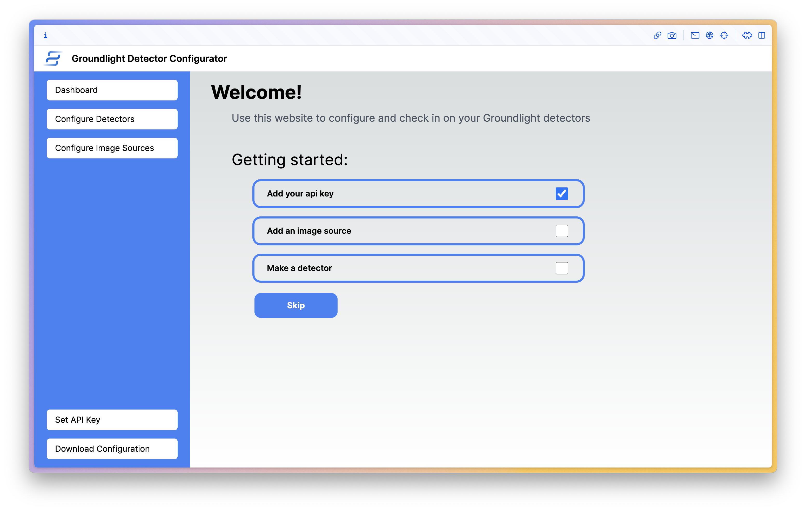
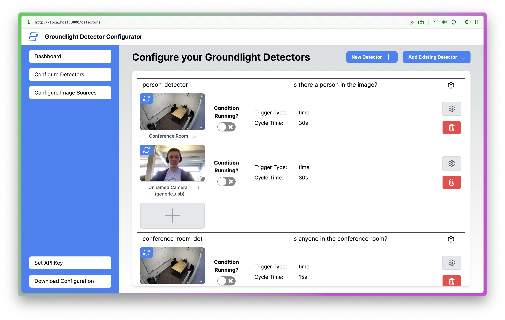

<p align="center">
  <a href="https://nextjs-fastapi-starter.vercel.app/">
    
    <h3 align="center">Groundlight Detector Builder</h3>
  </a>
</p>

<br/>

## What is the Groundlight Detector Builder?

Groundlight Detector Builder is an app you can deploy anywhere to easily build Groundlight Detectors, and configure them to pull from custom image sources and post notifications.

The Detector Builder has a simple web interface (depected below) that allows you to configure your detector, and a backend that runs on your device to pull images from your camera and post notifications.

### Intro Page



### Detector Dashboard



## Running from Docker

1. Create the file `docker-compose.yml` with the following contents:

```yaml
services:
  frontend:
    image: docker.io/maxatgroundlight/groundlight-edge-client-frontend:latest
    ports:
      - "3000:3000"
    depends_on:
      - backend
  backend:
    image: docker.io/maxatgroundlight/groundlight-edge-client-backend:latest
    ports:
      - "8000:8000"
    devices:
      - /dev/video0:/dev/video0
      - /dev/video1:/dev/video1
      - /dev/video2:/dev/video2
      - /dev/video3:/dev/video3
    privileged: true
    volumes:
      - /dev/bus/usb:/dev/bus/usb
```

2. Run `docker-compose up` in the same directory as the `docker-compose.yml` file.

## Running from Source

1. Install [Node.js](https://nodejs.org/en/download/) and [Python 3.8+](https://www.python.org/downloads/).

```bash
git clone https://github.com/groundlight/docker-edgelight-server.git
cd docker-edgelight-server
npm install
npm run dev
```

Open [http://localhost:3000](http://localhost:3000) with your browser to see the result.

The FastApi server will be running on [http://0.0.0.0:8000](http://0.0.0.0:8000) – feel free to change the port in `package.json` (you'll also need to update it in `next.config.js`).

